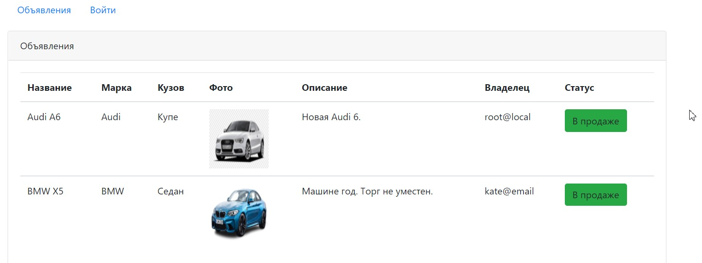

# Job4j. Проект "Сайт по продаже автомобилей".

Учебный проект в рамках курса job4j.
Технологии: Java, Servlets, Hibernate, JSP, JSTL, BootStrap.

В качестве СУБД используется Postgres.

Реализованные возможности:

- Регистрация и пользователя
- Возможность создать, обновить, удалить объявление
- Загрузка файлов

